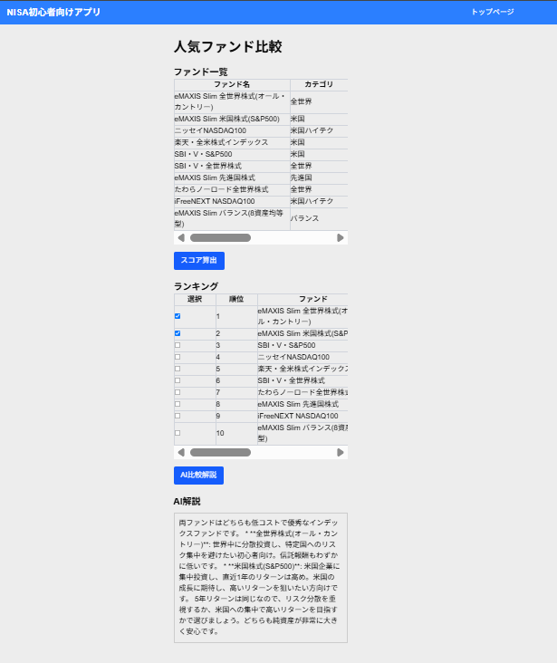
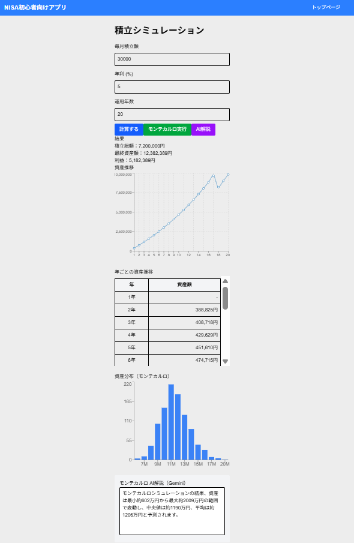
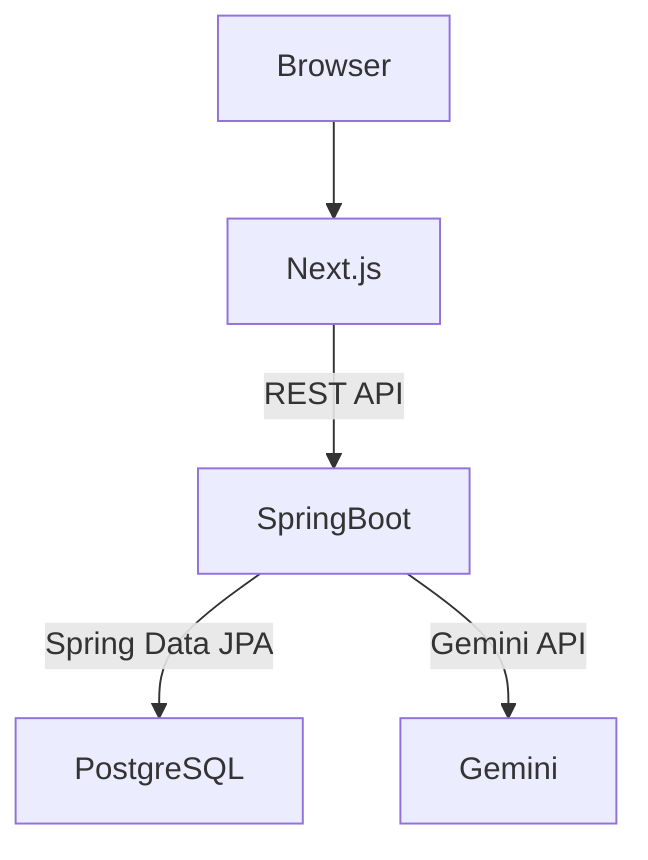
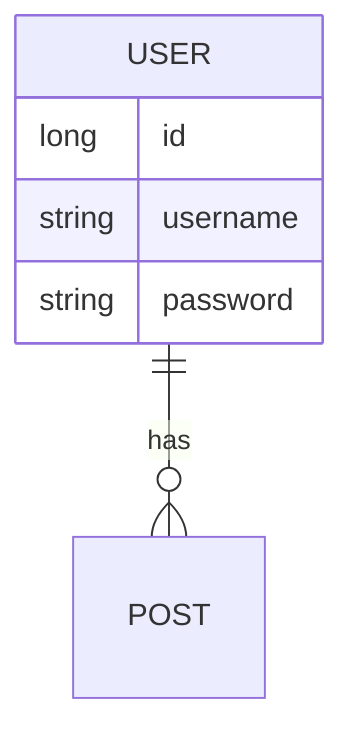
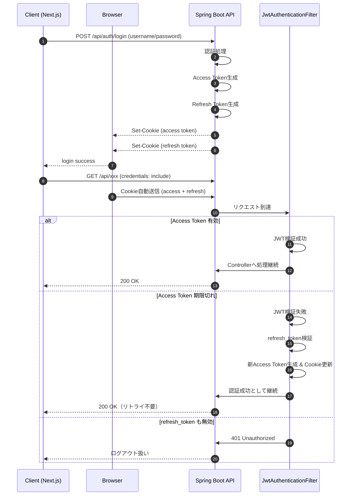

# NISA App

## 概要

初心者向けの新NISA積立支援アプリです。

人気ファンド比較、積立シミュレーション、
モンテカルロシミュレーションによるリスク分析、
Gemini APIを利用したAI解説機能を提供します。

## 画面イメージ

### 人気ファンド比較



### 積立シミュレーション



## 環境構築
```bash
git clone <repository>
cd nisa-app

cp .env.example .env
# GEMINI_API_KEYを設定

docker compose up --build
```

## DBリセット
```bash
docker compose down -v
docker compose up --build 
``` 

## 使用技術

- Frontend: Next.js 16 / TypeScript
- Backend: Spring Boot 3
- Database: PostgreSQL 16
- Authentication: JWT
- AI: Gemini API
- Container: Docker Compose

## システム構成図


## 認証方式

JWT認証（Cookieベース）

Access Token（有効期限15分）
- HttpOnly Cookie（token）で管理
- API認証に使用

Refresh Token（有効期限7日）
- HttpOnly Cookie（refresh_token）で管理
- Access Token再発行に使用

トークン更新
- フロントはAxios/fetchで401/403を検知
- /api/auth/refresh により自動更新
- 成功時はAccess Tokenを再発行し再リクエスト

## テストユーザー
開発環境では以下のテストユーザーが登録されています。

| ユーザー名 | パスワード |
|-----------|-----------|
| test | 12345678 |

## 開発環境

- トップ画面:http://localhost:3000

## ER図


## シーケンス図


## API仕様
### API Endpoints

- POST /api/simulation
- POST /api/simulation/montecarlo
- POST /api/simulation/montecarlo/explain
- POST /api/funds/analysis
- POST /api/auth/register
- POST /api/auth/refresh
- POST /api/auth/logout
- POST /api/auth/login
- GET /api/auth/me
- GET /api/funds
- GET /api/funds/score

### Swagger UI
```text 
http://localhost:8080/swagger-ui/index.html
```


## 入力制限について

### ユーザーAPI

| 項目 | 制約 |
|--------|--------|
| ユーザー名 | 登録済みのユーザー名は使用不可 |


### シミュレーションAPI

| 項目 | 制約 |
|--------|--------|
| 毎月積立金 | 0以上 |
| 年利 | -100〜100 |
| 運用年数 | 0〜100 |